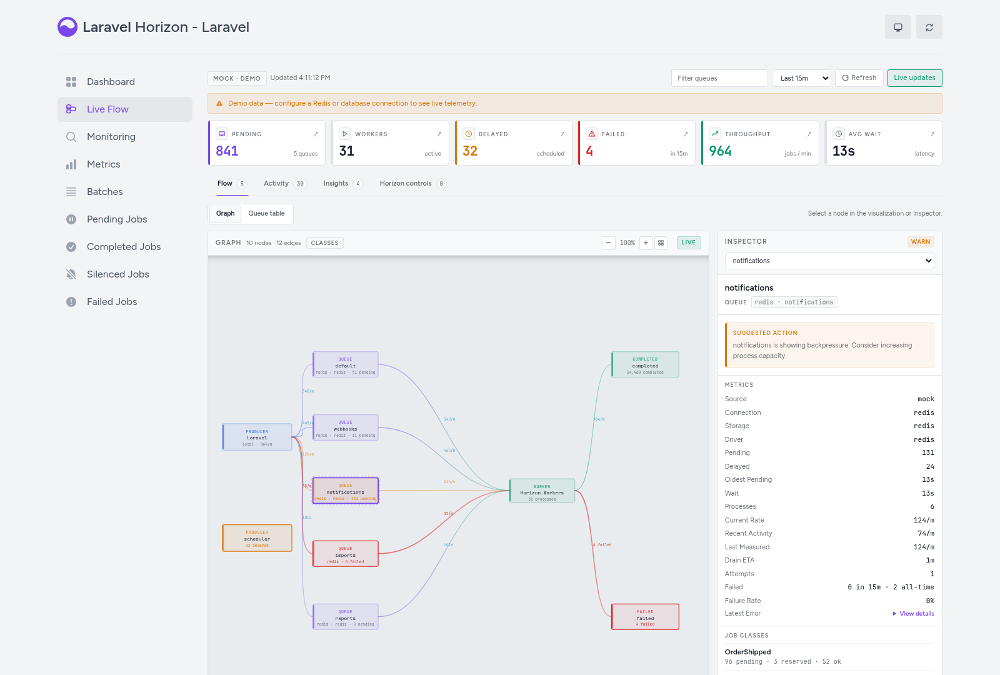
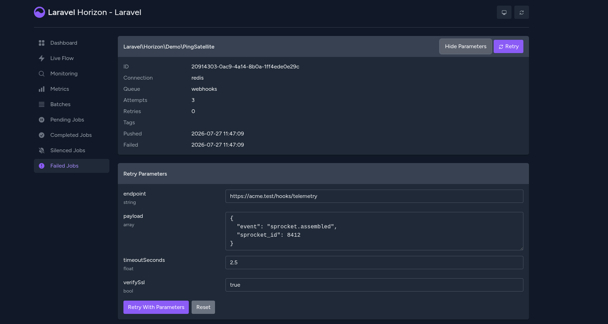

<h1 align="center">HorizonFlow</h1>

<p align="center">Live queue-flow visibility and operational insights for Laravel Horizon.</p>

<p align="center">
<a href="https://github.com/nsumbadze/horizonflow/actions/workflows/tests.yml"></a>
<a href="LICENSE.md"></a>
</p>

HorizonFlow is an independently maintained fork of [Laravel Horizon](https://github.com/laravel/horizon). It retains Horizon's dashboard and code-driven worker configuration while adding a live operational workspace for understanding how jobs move through queues. HorizonFlow is not an official Laravel product.

## Installation

HorizonFlow is installed instead of `laravel/horizon`; the two packages must not be installed together.

For a new installation, require HorizonFlow and publish Horizon's application service provider and configuration:

```bash
composer require nsumbadze/horizonflow
php artisan horizon:install
```

Laravel package discovery registers `Laravel\Horizon\HorizonServiceProvider`. The install command publishes `config/horizon.php` and creates `app/Providers/HorizonServiceProvider.php`, where dashboard authorization is configured. HorizonFlow's additional settings have working defaults; publish them only when you need to customize Live Flow:

```bash
php artisan vendor:publish --tag=horizonxflow-config
```

Run Horizon as you would the upstream package:

```bash
php artisan horizon
```

### Replacing Laravel Horizon

Applications already using `laravel/horizon` should preserve their `config/horizon.php` and `app/Providers/HorizonServiceProvider.php`, remove the upstream package requirement, and then install HorizonFlow with dependency updates allowed:

```bash
composer remove laravel/horizon --no-update
composer require nsumbadze/horizonflow --with-all-dependencies
```

The fork intentionally retains the `Laravel\Horizon` PHP namespace, service providers, Artisan commands, configuration shape, dashboard routes, and Redis data conventions. Composer declares that HorizonFlow replaces the Laravel Horizon `5.x` line, preventing both implementations from being installed together. Review [UPGRADE.md](UPGRADE.md) and test the change in a non-production environment before deployment; HorizonFlow has its own releases and version numbers and does not claim the same versions as upstream Horizon.

### Compatibility

HorizonFlow requires PHP 8.0 or later, Laravel 9.21 through 13, the JSON, PCNTL, and POSIX PHP extensions, and a Redis connection supported by Laravel. Install either the PhpRedis extension or `predis/predis`. PCNTL and POSIX are not available on Windows, so HorizonFlow should run in a Linux environment or a compatible container/virtual machine.

## Live Flow

**Live Flow** is available at `/horizon/live-flow`. It visualises producers, queues, jobs, workers, and results in real time across Redis and database queue drivers.

<p align="center">

</p>

Under a row of queue KPIs, the workspace is organised into four areas:

- **Flow** — the queue topology as an SVG **graph** (producers → queues → workers → completed/failed, with per-edge throughput), or the same data as a filterable, sortable **queue table**. Selecting a node opens the **Inspector**, which shows that node's metrics, drain ETA, failure rate, recent job classes, and a suggested action when a queue is under backpressure.
- **Activity** — a rolling stream of jobs entering, completing, and failing.
- **Insights** — an incident timeline (long waits, job failures, supervisor deployments), monitored tags, and recent batches.
- **Horizon controls** — pause and continue the master supervisors or an individual supervisor.

Selecting a Redis queue in the Inspector also exposes queue pause/resume controls and safe cancellation actions for its pending or running jobs.

The active workspace, graph/table mode, time window, queue filter, and selected node are reflected in the query string, so operational views can be shared directly.

To explore without a live queue, run `composer serve:demo`. This boots the workbench application with generated demo data and seeds a handful of failed jobs you can open and retry.

### Configuration

Live-flow behaviour is configured via `config/horizonxflow.php`:

| Key                                     | Default      | Description |
| --------------------------------------- | ------------ | ----------- |
| `flow.source`                           | `redis`      | One of `redis`, `database`, `auto`, `mock`. `auto` merges every configured source into a single payload. |
| `flow.sources`                          | `[redis]`    | Source list when `flow.source = auto`. Set via `HORIZONXFLOW_FLOW_SOURCES` (comma-separated). |
| `flow.recent_jobs.max`                  | `50`         | Cap on per-queue job rows returned to the inspector. |
| `flow.cache.queue_keys_ttl`             | `10`         | Seconds the Redis `SCAN` for queue keys is cached for. Set to `0` to disable. |
| `flow.cache.payload_ttl`                | `1`          | Seconds the full repository payload is memoised across requests. |
| `flow.database.connections`             | `[]`         | Explicit list of connections for the database driver. Empty means auto-discover from `queue.connections`. |
| `flow.database.discover_connections`    | `false`      | When `true` the database driver also walks `database.connections` (driver: mysql/pgsql/sqlite/sqlsrv) to find candidate `jobs` tables. |
| `flow.database.failed_table`            | `failed_jobs`| Table that holds failed-jobs entries. |

### Routes

| Path | Returns |
| ---- | ------- |
| `GET /horizon/api/flow`              | Full live-flow payload (kept for back-compat). |
| `GET /horizon/api/flow/summary`      | Header KPIs plus `failed_in_window`, `window_seconds`, and a `health[]` block per source. |
| `GET /horizon/api/flow/graph`        | Nodes and edges for the SVG flow graph. |
| `GET /horizon/api/flow/queues`       | Filterable / sortable queue rows (rows omit per-row job arrays for cheapness). |
| `GET /horizon/api/flow/queue-jobs`   | Recent jobs + job-classes for a single queue (`?key=driver:connection:name`). |
| `GET /horizon/api/flow/events`       | Activity stream. Pass `?since=<unix ts>` for incremental polling. |
| `GET /horizon/api/flow/incidents`    | Recent incidents (long waits, job failures, supervisor deployments) for the Insights timeline. |
| `POST /horizon/api/flow/queues/pause`  | Pause one Redis queue while retaining pending and newly dispatched jobs. |
| `POST /horizon/api/flow/queues/resume` | Resume processing one paused Redis queue. |
| `POST /horizon/api/jobs/{id}/cancel`   | Cancel a pending job or request cooperative cancellation of a running job. |

### Abilities

- `viewHorizon` — required to enter the dashboard (existing Horizon gate).
- `controlHorizon` — required for mutation endpoints (`POST /jobs/retry/{id}`, `POST /jobs/{id}/cancel`, `POST /flow/queues/{action}`, `POST /masters/{action}`, `POST /supervisors/{name}/{action}`) and for `GET /jobs/failed/{id}/parameters`, which backs retrying with edited parameters. When the gate is undefined, mutations are only allowed in `local` and `testing` environments; everywhere else, define the gate in `HorizonApplicationServiceProvider::gate()` to enable destructive actions for a trusted subset of users.

### Environment Variables

- `HORIZONXFLOW_FLOW_SOURCE` — overrides `flow.source`.
- `HORIZONXFLOW_FLOW_SOURCES` — comma-separated source list when `flow.source = auto`.
- `HORIZONXFLOW_FLOW_RECENT_JOBS_MAX` — overrides `flow.recent_jobs.max`.
- `HORIZONXFLOW_FLOW_QUEUE_KEYS_TTL` — overrides `flow.cache.queue_keys_ttl`.
- `HORIZONXFLOW_FLOW_PAYLOAD_TTL` — overrides `flow.cache.payload_ttl`.
- `HORIZONXFLOW_DISCOVER_DATABASE_QUEUES` — overrides `flow.database.discover_connections`.
- `QUEUE_FAILED_TABLE` — overrides `flow.database.failed_table`.

## Job and Queue Controls

The Live Flow Inspector can pause an individual Redis queue and cancel one pending or running job. These controls deliberately preserve Laravel's queue safety boundaries:

- Pausing a queue does not reject dispatches or kill workers. A job already running finishes, while pending and newly dispatched jobs remain queued until the queue is resumed.
- Cancelling a pending job atomically removes its exact payload from the ready list or delayed set. If a worker reserves it first, HorizonFlow records a cooperative cancellation request instead of reporting a false success.
- A running worker process is never force-killed. Side effects already performed by a job cannot be rolled back by HorizonFlow.
- Cancelled jobs remain visible in the Inspector with their cancellation time and operator identifier. Repeated requests are idempotent, and completed or failed jobs return `409 Conflict`.

Mutation routes use the `controlHorizon` ability described above. Queue connection and queue names are validated server-side, raw job payloads are never accepted from or returned to the control UI, and every destructive action has an explicit confirmation step.

### Cooperative cancellation checkpoints

A running job must opt in before it can stop between units of work. Add `InteractsWithCancellation` and return from `handle()` when a checkpoint acknowledges the request:

```php
use Illuminate\Contracts\Queue\ShouldQueue;
use Illuminate\Foundation\Queue\InteractsWithQueue;
use Laravel\Horizon\Concerns\InteractsWithCancellation;

class SendCampaignMail implements ShouldQueue
{
    use InteractsWithQueue;
    use InteractsWithCancellation;

    public function handle(): void
    {
        foreach ($this->recipients as $recipient) {
            if ($this->cancelIfRequested()) {
                return;
            }

            $this->sendTo($recipient);
        }
    }
}
```

Place checkpoints before idempotent units of work. A cancellation requested while a single non-interruptible call is executing—for example, an SMTP hand-off—takes effect only after that call returns and the next checkpoint is reached.

Queue and job controls currently support Redis queues. Database queues remain observable in Live Flow but do not expose these mutation controls.

When `flow.source` is `mock`, the Inspector exposes the same controls as a session-only visual simulation. Pausing, cancelling, and retrying update only the browser state and never call a mutation endpoint or change Redis. Mock failures are available from Live Flow's queue Inspector and Activity workspace; Horizon's separate Failed Jobs page continues to show only real failed jobs.

## Retry With Parameters

A failed job usually fails because of what it was handed: a wrong path, a batch size that was too large, a flag left on. Horizon can only push that same job back onto the queue unchanged, so the normal fix is a tinker session or a one-off command. HorizonFlow lets you change the arguments and retry from the dashboard instead.

Open a failed job and press **Edit Parameters**. HorizonFlow reads the job class constructor and lists every parameter it accepts, prefilled with the values the failed job was queued with:

<p align="center">

</p>

Change what you need and press **Retry With Parameters**. The job is queued as a normal retry, so it still shows up under the original job's retry history.

What you can edit:

- `string`, `int`, `float`, `bool`, `array` and `iterable` parameters, plus untyped ones holding those values. Arrays are edited as JSON.
- Nullable parameters get a **Send as null** toggle.
- Parameters that were never passed still appear, prefilled with their declared default.

What you cannot edit, and why the panel says so next to each one:

- Objects and Eloquent models. They are shown read-only rather than hidden, so you can still see what the job was carrying.
- Queued closures, and jobs whose class no longer exists in the application.

Values are cast to the parameter's declared type before the job is queued (`"9"` becomes `9` for an `int`). Anything that does not fit is rejected with a `422` and the reason, and nothing is queued. Jobs implementing `ShouldBeEncrypted` are decrypted for inspection and re-encrypted on the way out.

Editing parameters is gated by `controlHorizon`, the same ability an ordinary retry needs. Both the read and the retry go through it:

| Path | Returns |
| ---- | ------- |
| `GET /horizon/api/jobs/failed/{id}/parameters` | The job's constructor parameters, their current values, and whether each one may be edited. |
| `POST /horizon/api/jobs/retry/{id}`            | Retries the job. Accepts an optional `parameters` object of overrides. |

To try it locally, `composer serve:demo` seeds three failed demo jobs. You can also seed or remove them directly:

```bash
php artisan horizonxflow:demo-jobs
php artisan horizonxflow:demo-jobs --clear
```

## Upstream Horizon

HorizonFlow is derived from Laravel Horizon and keeps its existing dashboard, queue supervision, metrics, and worker configuration. Refer to the [Laravel Horizon documentation](https://laravel.com/docs/horizon) for inherited Horizon behaviour.

Laravel Horizon was created by Taylor Otwell and is maintained by Laravel and its contributors. HorizonFlow retains Laravel Horizon's original copyright and license notices. Issues caused by HorizonFlow changes should be reported in this repository; bugs that also exist in unmodified Laravel Horizon may belong in the upstream issue tracker. Upstream Laravel Horizon has its own release process.

## Contributing

Contributions are welcome. Please read the [contribution guide](.github/CONTRIBUTING.md) and [Code of Conduct](.github/CODE_OF_CONDUCT.md) before opening an issue or pull request.

## Security

Do not disclose security vulnerabilities in public issues. Follow this repository's [security policy](.github/SECURITY.md) to report them privately.

## License

HorizonFlow is released under the [MIT license](LICENSE.md). The original Laravel Horizon copyright and license notice are retained.
